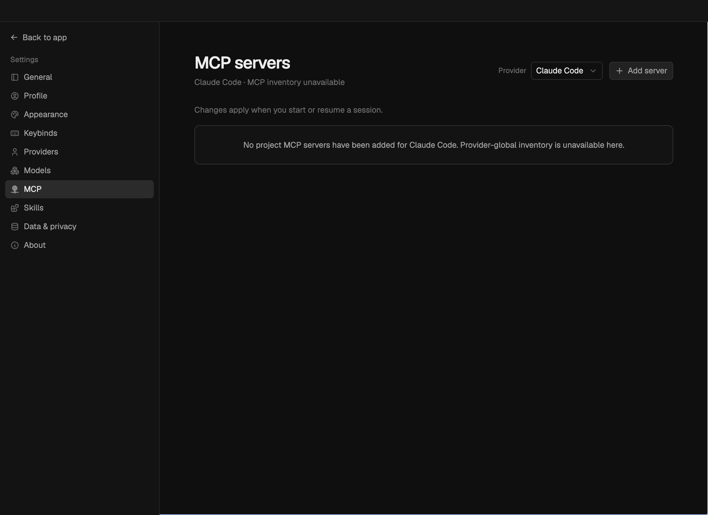
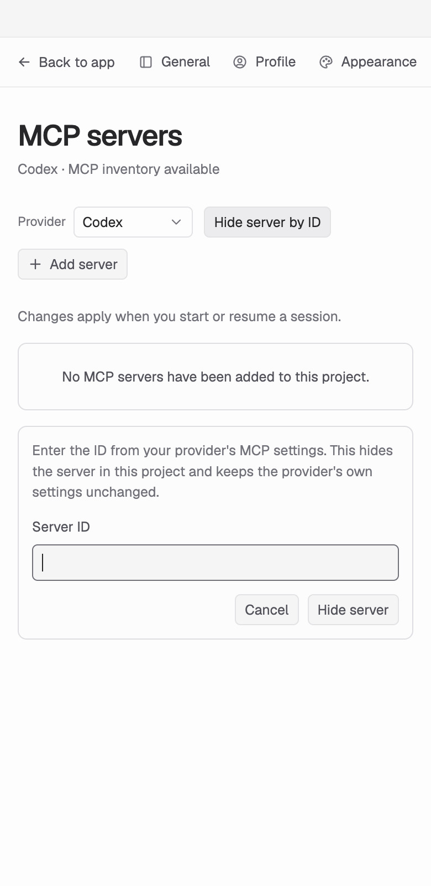
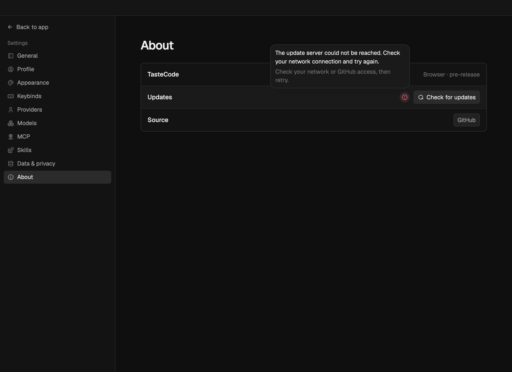

# PR quality work — 2026-09-09

## Delivery update — 2026-09-12

The local source changes have now shipped through the following focused PRs. Each passed lint, typecheck, tests and build against its current main base. Live UI and Design evidence is attached to the PRs. The release tools also passed the license gate, a fresh unsigned macOS native-module proof, and byte checks for all 132 bundled reference images.

- [build: add local release artifact validation tools](https://github.com/Leonxlnx/tastecode/pull/1095)
- [feat(desktop): add native image copy menu](https://github.com/Leonxlnx/tastecode/pull/1083)
- [fix(design): preserve approved references and assets](https://github.com/Leonxlnx/tastecode/pull/1096)
- [feat(web): open recent sessions with number shortcuts](https://github.com/Leonxlnx/tastecode/pull/1084)
- [fix(web): cache the complete installed font list](https://github.com/Leonxlnx/tastecode/pull/1085)
- [fix(web): manage provider updates in the update notice](https://github.com/Leonxlnx/tastecode/pull/1086)
- [feat(web): show account limit usage in the sidebar](https://github.com/Leonxlnx/tastecode/pull/1087)
- [fix(web): align queued message reveal timing](https://github.com/Leonxlnx/tastecode/pull/1088)
- [fix(web): remove mouse press flashes](https://github.com/Leonxlnx/tastecode/pull/1089)
- [fix(web): show thumbnails while full images load](https://github.com/Leonxlnx/tastecode/pull/1090)
- [fix(web): clarify expanded activity steps](https://github.com/Leonxlnx/tastecode/pull/1091)
- [fix(web): hide automatic review cards in chat](https://github.com/Leonxlnx/tastecode/pull/1092)
- [fix(web): clear saved attachments after sending](https://github.com/Leonxlnx/tastecode/pull/1093)
- [fix(codex): apply approval changes on each turn](https://github.com/Leonxlnx/tastecode/pull/1094)

Windows, signing, notarization, installer and version-to-version update checks remain release gates. No hosted CI or release publication was started. The record below describes the earlier September 9 snapshot; it is historical evidence, not the latest release status.

## Historical snapshot

Local implementation based on main `210e071588faca59f15a734b4046d45ab79c8103`.
The existing GitHub PRs have not been pushed, merged, or marked ready by this work.

| PR    | Result                                                                                                                                                                                                                                                                                    |
| ----- | ----------------------------------------------------------------------------------------------------------------------------------------------------------------------------------------------------------------------------------------------------------------------------------------- |
| #1059 | Shared error tooltips escape clipped Settings cards, fit the window, remain readable under the pointer, and support focus and Escape. Touch does not create hover state.                                                                                                                  |
| #1048 | Static previews parse real HTML and reject missing local resource references, including bare and density `srcset` candidates, base URLs, preloads, and SVG image links. Parsing and reference counts are bounded.                                                                         |
| #1004 | Design rejects duplicate or unsafe briefing question IDs before they reach answer storage.                                                                                                                                                                                                |
| #1006 | Exact output rules inspect nested files, preserve the initial file baseline, and reject symlink deliverables or extra output under existing folders.                                                                                                                                      |
| #983  | Provider account rows use consistent email or “Signed in” labels, with the existing privacy treatment.                                                                                                                                                                                    |
| #1041 | Hidden preview capture uses bounded animation-frame, image, font, and animation waits; it restores scrolling and removes pending listeners and timers.                                                                                                                                    |
| #1039 | Design retains supplied reference pixels and selected direction IDs, validates real asset files and source quality, and checks approved artifacts and media again before reuse.                                                                                                           |
| #986  | Claude project MCP definitions reach start and resume. The SDK control channel scopes credentials to each server, away from process arguments, shared environment, and diagnostics. Unsupported inherited-server hiding and custom server working directories are rejected before saving. |
| #1000 | Workspace APIs also protect `.boto`, `_netrc`, `credentials.tfrc.json`, and `application_default_credentials.json`, using the existing canonical path rules.                                                                                                                              |
| #937  | Manual release tooling verifies exact source, file lists, hashes, updater metadata, licenses, native bindings, and packaged references. Optional draft uploads never replace assets or publish a release.                                                                                 |

## Verification

All five combined checks passed on the same unchanged source tree:

- `pnpm lint`
- `pnpm typecheck`
- `pnpm test`: **2,736 tests passed**, including 77 Claude adapter tests and 114 Design tests.
- `pnpm build`
- `pnpm licenses:verify`: 398 packages checked.

The frozen lockfile check passed with dependency scripts disabled. The local commands used
the installed pnpm 11.8.0 executable because the system wrapper stalled.

A fresh unsigned macOS arm64 app also passed the packaged terminal and keychain checks.
All 132 bundled reference images match the source by filename and SHA-256. This was a
directory package; it does not establish installer, signing, or update-feed readiness.

[Recorded check results](./pr-quality-2026-09-09/integration-evidence.json) include the
source fingerprint, full test counts, package proof, and server/Claude runtime results.

The native UI proof renders the current Settings components in Electron with a synthetic
transport. It checks light and dark themes, keyboard focus, Escape, account privacy, tooltip
placement, and a 390 px window. It is component integration evidence, not an authenticated
provider session. A separate real WebSocket server proof checks current MCP add/update/remove
and rejection before persistence with isolated project data.

The real Claude binary connects to local HTTP and stdio MCP fixtures, preserves unrelated
inherited servers, replaces a matching inherited definition, and resumes a transcript created
through a local Anthropic-protocol fixture. No paid model request is part of this proof.
An independent review passed after checking credential isolation, failure paths, and cleanup.
The runtime proof confirms that temporary endpoints and all four MCP child processes stop.

## Remaining release evidence

- Windows installer and native runtime checks require a Windows host.
- Signing, notarization, clean-machine product QA, and a real version-to-version updater run
  remain release gates. No hosted Actions or release uploads were started.
- Tests do not establish the quality of a new model-generated design. Reference retention,
  approval integrity, and asset validation are checked; final visual fidelity still needs a
  real Design run against the intended model and input.
- Older interrupted Design runs without the required trusted snapshots stop with a restart
  message. Their artifact files remain readable.

## UI evidence

Screenshots are captured after fonts and transitions settle. They use test account data.

