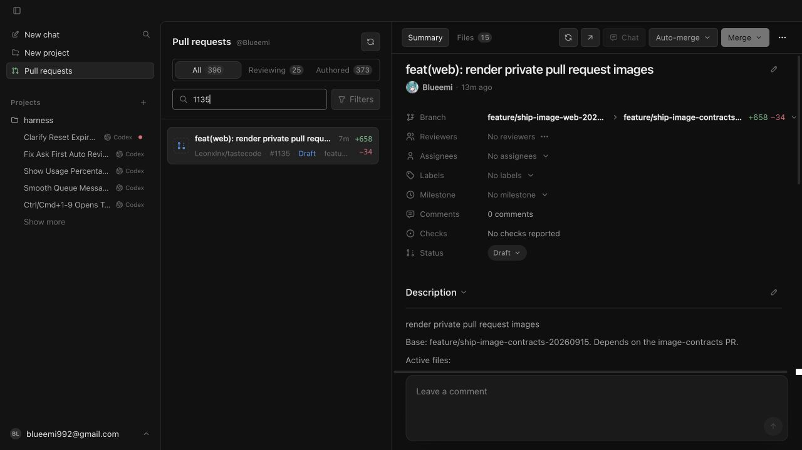
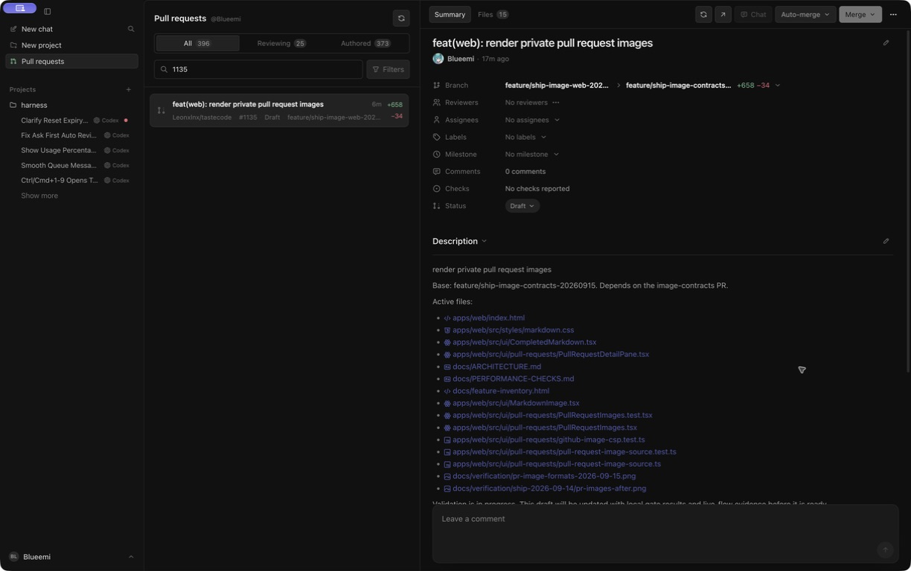
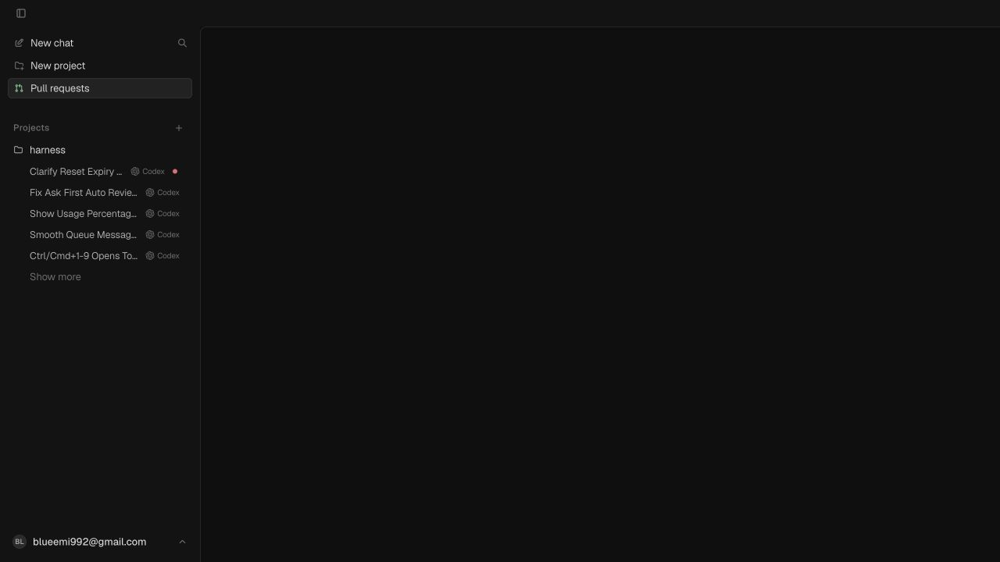
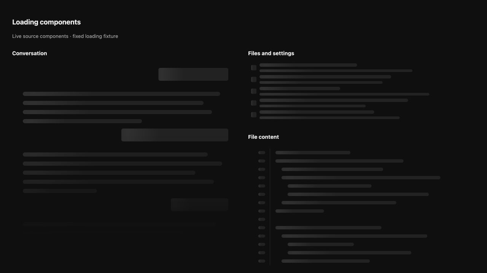
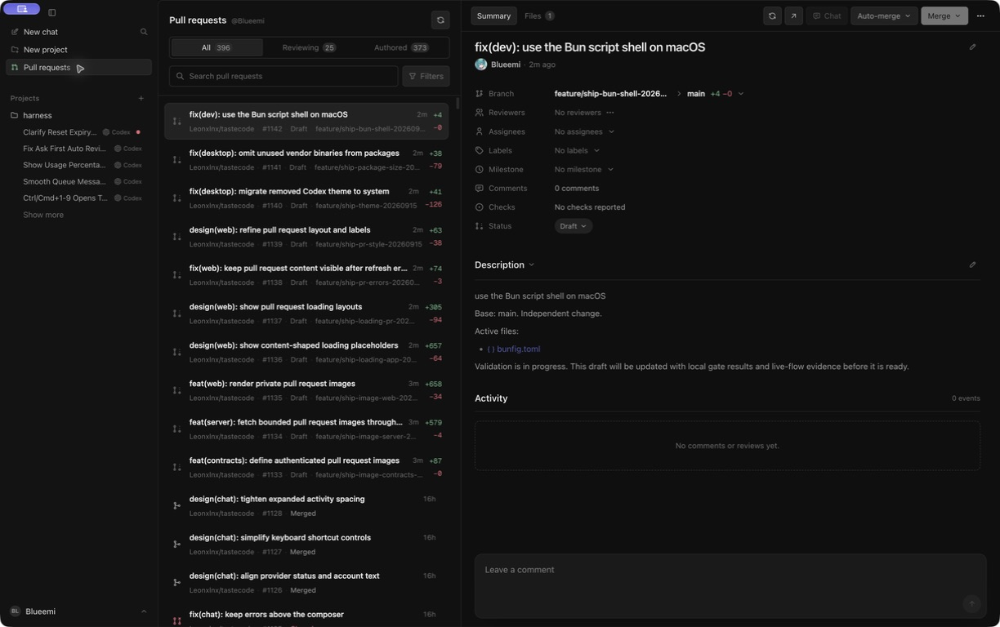
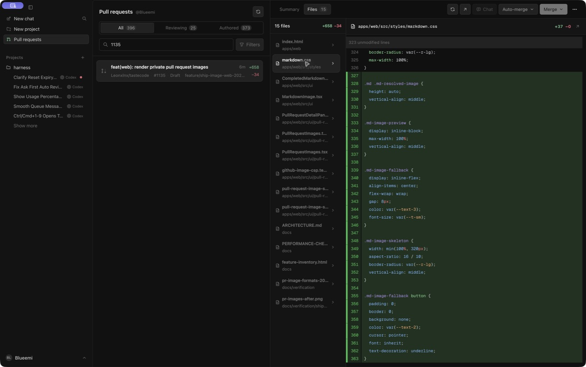
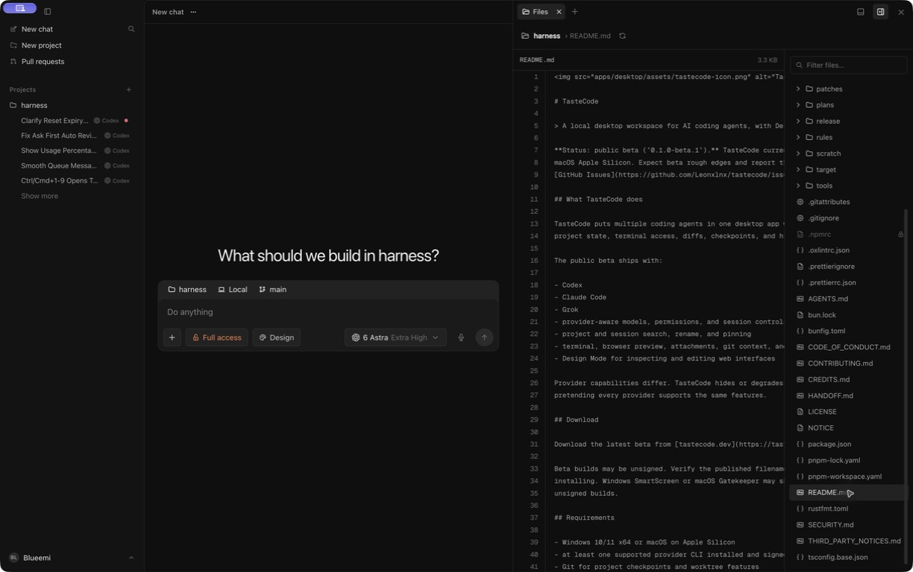
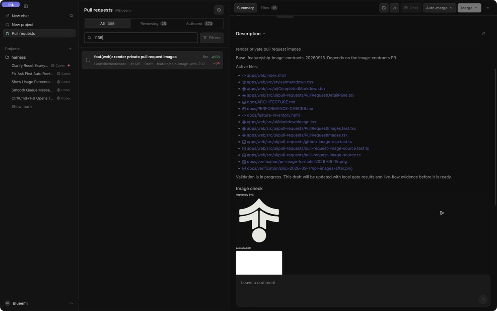
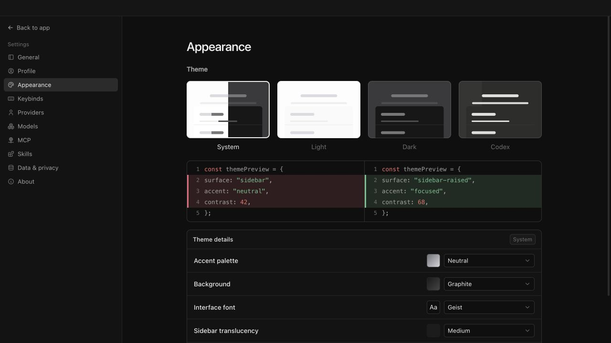
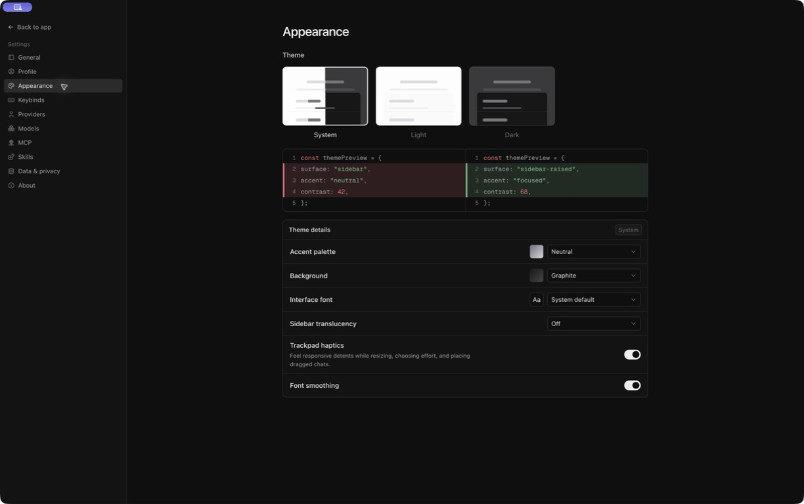

# Local verification: 2026-09-15

The ten code PRs below were checked separately against main `759d8141ebc8bdd4fe17b3dbaa026fe62a4711b9`. The image server and web branches include the image contracts; the PR loading branch includes the shared loading components. This report records local evidence. The PRs still require protected-branch review before merge.

## Required checks

Every listed head passed `pnpm lint`, `pnpm typecheck`, `pnpm test`, and `pnpm build` on macOS arm64 with Node 22.22.3 and pnpm 11.8.0. No hosted CI was started.

| PR                                                       | Scope                                                              | Checked head                               | Four checks |
| -------------------------------------------------------- | ------------------------------------------------------------------ | ------------------------------------------ | ----------- |
| [#1133](https://github.com/Leonxlnx/tastecode/pull/1133) | feat(contracts): define authenticated pull request images          | `c475e104038c4bd2a693d3c0602ecb43315a4bf4` | Pass        |
| [#1134](https://github.com/Leonxlnx/tastecode/pull/1134) | feat(server): fetch bounded pull request images through GitHub CLI | `14f5420be979f37b65001b561a3ec0a9601ce2f3` | Pass        |
| [#1135](https://github.com/Leonxlnx/tastecode/pull/1135) | feat(web): render private pull request images                      | `91afff581d41c8b57a3540fab4e703887f19cbae` | Pass        |
| [#1136](https://github.com/Leonxlnx/tastecode/pull/1136) | design(web): show content-shaped loading placeholders              | `e43a10a993cbdae90c444dc155cda938d9e92f7c` | Pass        |
| [#1137](https://github.com/Leonxlnx/tastecode/pull/1137) | design(web): show pull request loading layouts                     | `5e5ae6e3b2e770fe90fd885681eb5fc8087f1170` | Pass        |
| [#1138](https://github.com/Leonxlnx/tastecode/pull/1138) | fix(web): keep pull request content visible after refresh errors   | `7503ba929bfc5447753bef2aba46238e550d3c13` | Pass        |
| [#1139](https://github.com/Leonxlnx/tastecode/pull/1139) | design(web): refine pull request layout and labels                 | `e531a36f1c57ed48bdaaeca7b7830becebc17a22` | Pass        |
| [#1140](https://github.com/Leonxlnx/tastecode/pull/1140) | fix(desktop): migrate removed Codex theme to system                | `f83ae0c2e9172d3697f68282e6348ea76a94a908` | Pass        |
| [#1141](https://github.com/Leonxlnx/tastecode/pull/1141) | fix(desktop): omit unused vendor binaries from packages            | `b15e10aa2981bfbf82031ad1b7c0e6423a8b22d8` | Pass        |
| [#1142](https://github.com/Leonxlnx/tastecode/pull/1142) | fix(dev): use the Bun script shell on macOS                        | `be2e6cae375729eecfb12f10baefdbcc3e89f25b` | Pass        |

The Bun-shell full suite initially hit the existing SessionSearchHost focus-test timeout. Its focused eight tests and a second full suite passed without a source change.

## Live checks

Native screenshots below show the current combined source tree, including the diff-error fix in #1137. Baseline screenshots use the original main renderer in the in-app browser. They are flow and visual evidence; the separate branch checks above establish each code head.

- The native app loaded the real PR list and detail view. The read-only WebSocket list request returned 396 items.
- The authenticated image request for a PNG committed to this private repository returned `image/png`, 16,706 bytes in 565 ms. The same image then appeared in the native PR body.
- The native Files tab rendered both an HTML diff and a CSS diff. The workspace Files tab opened README source.
- Appearance showed System, Light and Dark. Migration tests cover the removed Codex preference.
- The diff-error regression test failed on the old source and passed after the loading overlay recognized the renderer's error element. Both normal-content and error cases pass.
- `bun run lint` passed with the committed Bun shell configuration.

## Performance

`node apps/desktop/scripts/verify-performance.js 3 <output>` passed against the combined source tree. All three renderer samples visited 500 messages. First paint was 34.7 / 25.2 / 25.0 ms; worst scroll frame was 15.7 / 9.4 / 9.3 ms; longest stream batch was 1.6 / 1.1 / 1.3 ms. Cold interactive time was 546 / 558 / 530 ms. The verifier reported no failures and closed its test processes. These are local samples, not cross-platform release claims.

## Mac package

On the exact #1141 head, a fresh isolated `pnpm install --offline --frozen-lockfile --ignore-scripts` completed. License verification checked 397 packages; the full build and preload build passed. An unsigned local arm64 directory package was produced with `electron-builder --mac --arm64 --dir --publish never`.

The finished archive is 20,213,608 bytes with 1,922 entries. Inspection found no platform-specific Claude SDK CLI packages, Windows/Linux node-pty prebuilds, Zod source, or dependency source maps and declaration maps targeted by the new filters. The core Claude SDK, server, Mac arm64 PTY, and license bundle remain present. `node apps/desktop/scripts/run-native-binding-proof.js <packaged-app>` passed both PTY and keyring proofs. Windows packaging, signing, and notarization were not run.

## Images

### PR layout

Baseline renderer on original main:

Current native app:

### Loading and loaded content

Baseline detail loading view:

Current exported loading components in a fixed browser fixture. This image deliberately holds loading states; it does not depict a pending live request:

Native PR list after loading:

Native CSS diff after loading:

Native workspace file after loading:

### Authenticated image

A private-repository image in the native PR body:

### Theme choices

Baseline renderer on original main:

Current native app:

